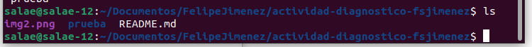

# Actividad Diagnóstico

### 1. ¿Qué lenguajes de programación ha usado?

Java, Python, PHP, C++, Scala

### 2. ¿Qué comandos conoce de GIT?

add, clone, commit, push

### 3. Ejemplifique el comando de Linux: mv

Mover archivos a otra ubicación

### 4. Ejemplifique el comando de Linux: cp

Copia un archivo a otro

### 5. Ejemplifique el comando de Linux: mkdir

Crea un nuevo subdirectorio o carpeta del sistema de archivos

### 6. Ejemplifique el comando de Linux: ls

Lista archivos y directorios

### 7. Ejemplifique el comando de Linux: pwd

Indica la ruta en la que me encuentro actualmente

### 8. Ejemplifique el comando de Linux: touch ---
### 9. Ejemplifique el comando de Linux: grep ------
### 10. Ejemplifique el comando de Linux: cd

Permite moverse entre directorios

### 12. Ejemplifique el comando de Linux: cat

Ver el contenido de un archivo con el comando cat

